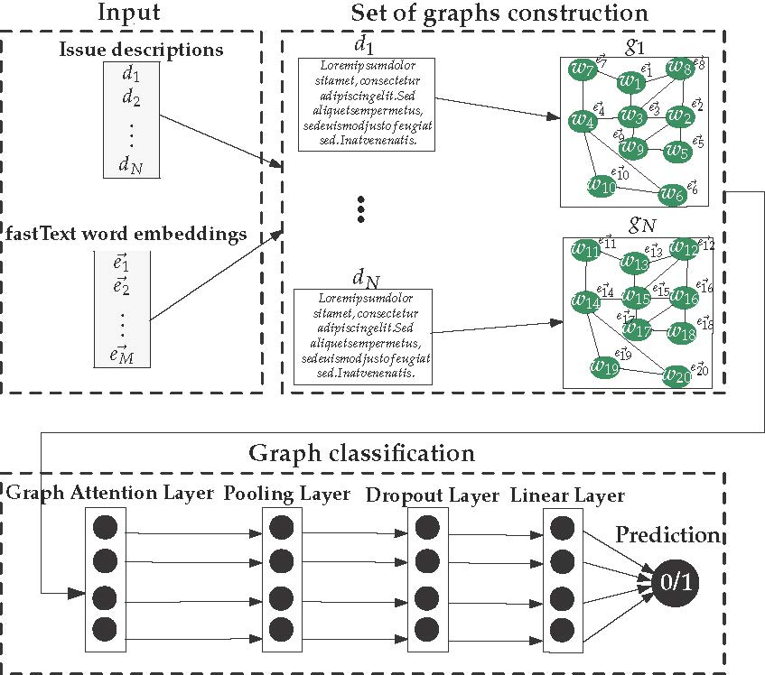

# Software bug prediction using graph neural networks and graph-based text representations

This repository is the official implementation of the paper "[Software bug prediction using graph neural networks and graph-based text
representations](https://www.sciencedirect.com/science/article/pii/S0957417424021572)" accepted in the "Expert Systems with Applications" journal.

## Overview

This paper proposes a hybrid approach that builds on the strengths of word embeddings techniques, graph-based representation of textual data and graph neural networks for the prediction of software bugs. Existing approaches aim to improve each of these components individually, thus neglecting structural or semantical underlying information. On the contrary, the approach presented in this paper aims to leverage both types of information by representing each text as a graph and utilizing Graph Attention Networks (GATs). The experiments took place using four datasets of short-text GitHub and Jira issues, which are publicly available on the kaggle.com and zenodo.com platforms respectively.



## Requirements

* Code is written in Python 3.9
* Create a virtual environment and activate it: `source env/bin/activate`
* `pip install -r requirements.txt`

## Datasets
The datasets needed to run the experiments are available [here](https://github.com/nkanak/bug-or-feature/tree/main/datasets).

##  Run experiments and reproduce results
1. Run the jupyter notebook `experiments.ipynb` to reproduce the experiments.
2. Execute `python ablation_study_word_embeddings.py` to get the ablation studies for Section 4.5.
3. To generate various plots of the paper run the jupyget notebook `generate_dataset_plots.ipynb`.
4. Execute `python parameter_sensitivity.py` to get the parameter sensitivity results for Section 4.4.
5. Code for the statical significance tests is available in the `statistical_test.py` file.

## Bibliography

Please cite our two papers if you use this code:
[Paper 1](https://www.sciencedirect.com/science/article/pii/S0957417424021572), [Paper 2](https://ieeexplore.ieee.org/abstract/document/10097947)

```bibtex
@article{SIACHOS2025125290,
title = {Software bug prediction using graph neural networks and graph-based text representations},
journal = {Expert Systems with Applications},
volume = {259},
pages = {125290},
year = {2025},
issn = {0957-4174},
doi = {https://doi.org/10.1016/j.eswa.2024.125290},
url = {https://www.sciencedirect.com/science/article/pii/S0957417424021572},
author = {Ilias Siachos and Nikos Kanakaris and Nikos Karacapilidis}
}
```

```bibtex
@inproceedings{kanakaris2022bug,
  title={Is it a bug or a feature? Identifying software bugs using graph attention networks},
  author={Kanakaris, Nikos and Siachos, Ilias and Karacapilidis, Nikos},
  booktitle={2022 IEEE 34th International Conference on Tools with Artificial Intelligence (ICTAI)},
  pages={1425--1429},
  year={2022},
  organization={IEEE}
}
```

## Contributors
* Ilias Siachos (ilias.siachos@ac.upatras.gr)
* Nikos Kanakaris (kanakari@usc.edu)
* Nikos Karacapilidis (karacap@upatras.gr)
